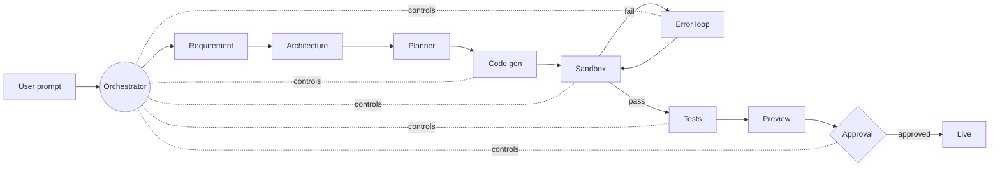

<div align="center">

# ZaZaPHI

**An AI app builder where the orchestration layer is the product — not the model.**

`prompt → spec → plan → controlled generation → sandbox → error loop → preview → approval → live`

</div>

---

Anyone can wire `prompt → model → code`. That is a script, not a product. ZaZaPHI owns everything the model does **not**: state, memory, token budgets, file visibility, retries, sandbox limits, tests, deployment and human approval. The model is one swappable component behind a gateway.

> **The one line:** "The generation engine is Groq/Claude, but the product is the orchestration around it — token budgeting, context retrieval, prompt caching, model routing, diff-based edits, isolated Docker sandboxes, an error→fix loop and approval-gated deploys. The model never directly controls state, the filesystem or deployment."

## Architecture



The agents never control the system. The orchestrator decides which agent runs, what files are visible, what commands may run, the token budget, the retry budget, the approval requirement and the sandbox limits. Each agent only sees the `context_packet` it is handed and returns a structured, validated result.

## Repository layout

```
zazaphi/
├── apps/
│   ├── api/            backend entrypoint + HTTP server + demo runner
│   └── web/            product UI (built after the engine)
├── packages/
│   ├── contracts/      shared Zod schemas + types — the single source of shape
│   ├── core/           the orchestrator: pipeline, state machine, error loop
│   ├── gateway/        provider-agnostic LLM boundary (Groq)
│   ├── context/        memory tiers + prompt caching
│   ├── economics/      token/cost budgets + routing
│   ├── sandbox/        isolated Docker execution + security
│   ├── services/       service_manifest → docker-compose
│   └── deploy/         auto preview + approval-gated production
└── generated-projects/ where generated apps are written (gitignored)
```

Every subsystem sits behind a port defined in `@zazaphi/core`. Implementations are chosen in exactly one place — the composition root in `apps/api/src/wiring.ts` — so any one can be replaced without touching control flow.

## Shared contracts

These shapes flow between modules. No package invents its own version; they live in `@zazaphi/contracts` as Zod schemas that are both the compile-time type and the runtime validator at every trust boundary.

| Contract | Purpose |
| --- | --- |
| `task_spec` | one unit of work |
| `context_packet` | the minimal input assembled for one model call |
| `LLMRequest` / `LLMResponse` | provider-agnostic generation |
| `task_budget` | token / retry / edit-mode envelope |
| `sandbox_result` | structured outcome of an isolated run |
| `service_manifest` | single vs multi-service topology |

## Quickstart

```bash
pnpm install
pnpm build          # type-check + compile every package
pnpm demo           # run a prompt end to end with the stubbed subsystems
pnpm dev            # start the HTTP API on :4000
```

```bash
# HTTP API
curl -X POST localhost:4000/runs -d '{"prompt":"Build a CRM for freelancers"}'
curl -X POST localhost:4000/runs/<run_id>/approve -d '{"approved":true}'
```

## Status & roadmap

The orchestration spine is complete and runs the full pipeline end to end. Each subsystem is wired behind its contract and replaced with its real implementation in turn:

- [x] Contracts + orchestration spine + bounded error loop
- [x] Composition root, HTTP API, end-to-end demo
- [ ] Gateway — real Groq calls, structured output, streaming, routing
- [ ] Context — retrieval, fidelity selection, prompt caching
- [ ] Economics — live cost dashboard
- [ ] Sandbox — Docker isolation, build/test, command limits
- [ ] Services — compose generation, multi-service mode
- [ ] Deploy — env handling, GitHub push, rollback
- [ ] Web — product UI

## Design decisions

| Decision | Choice | Why |
| --- | --- | --- |
| Inference | Groq for MVP, behind a gateway | Fast and cheap now; never lock the product to one provider |
| Sandbox | Docker container per project | Cheap, full control, good enough for MVP |
| Service mode | Single-service MVP, manifest designed in | Ship fast without painting into a corner |
| Editing | Diff over full-file regeneration | The biggest token saving; avoids touching unrelated files |
| Deploy | Preview auto, production approval-gated | Safety and cost control |
| Memory | Retrieve relevant files, never the full repo | Token cost and consistency |

## Tech

TypeScript (strict) · Node 20 · ESM · Zod · pnpm workspaces
