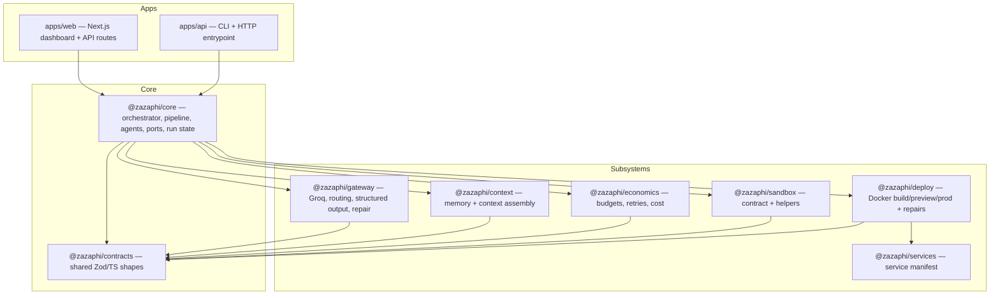
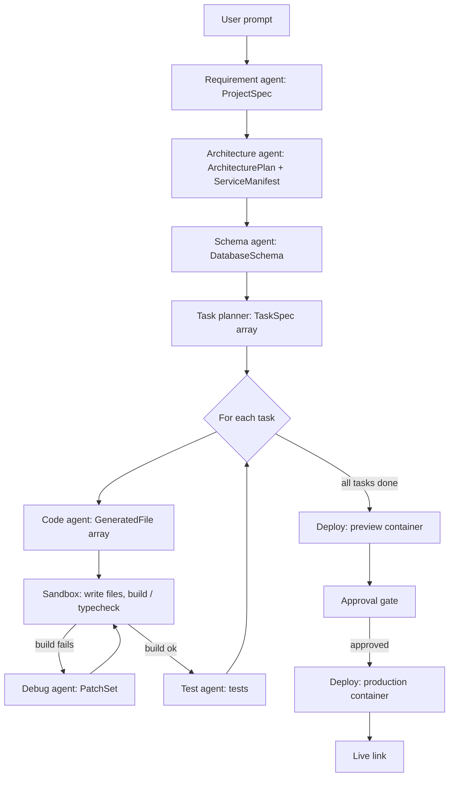
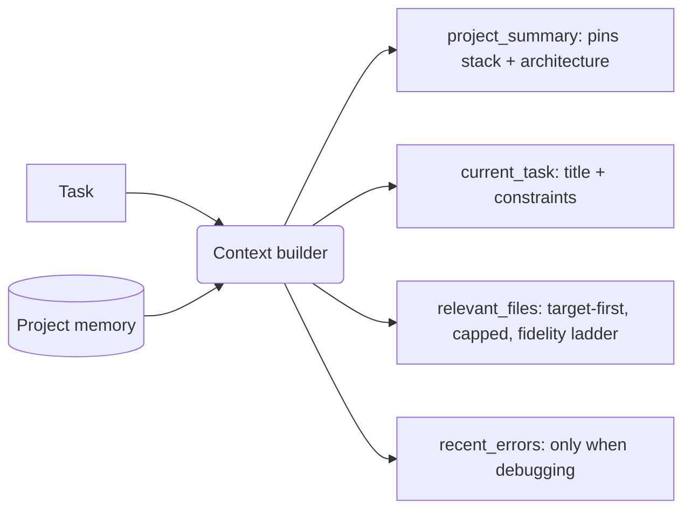
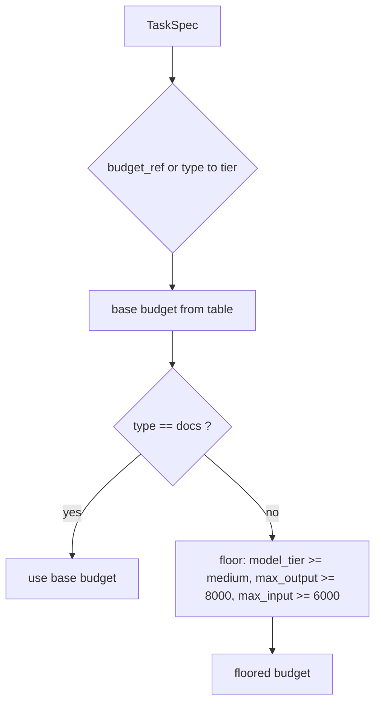
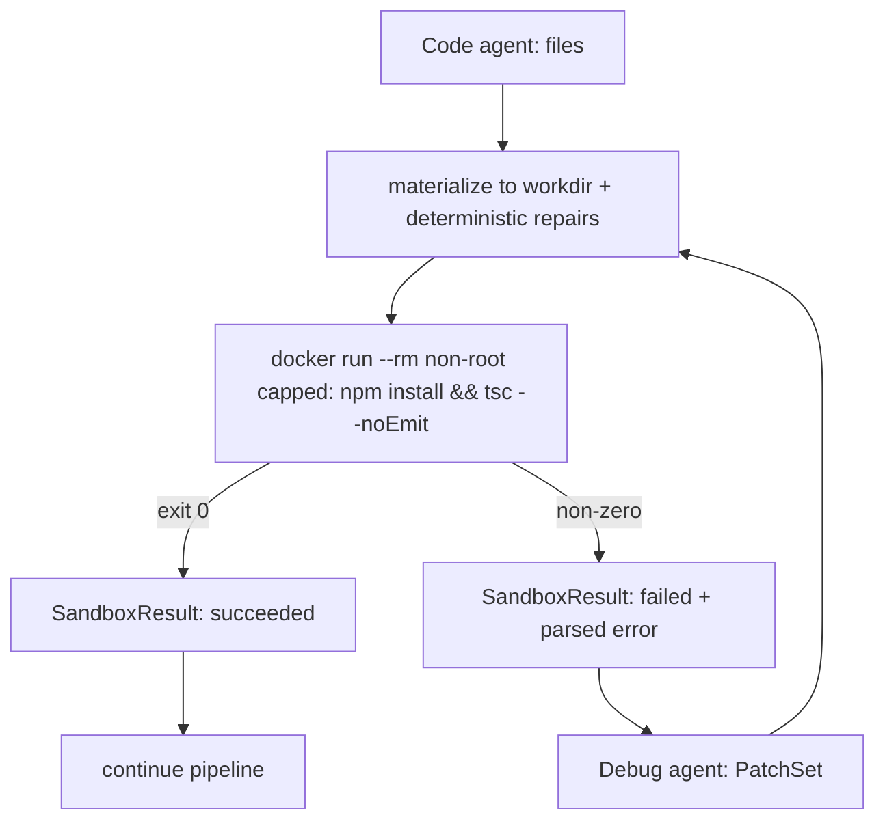
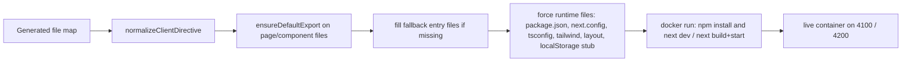
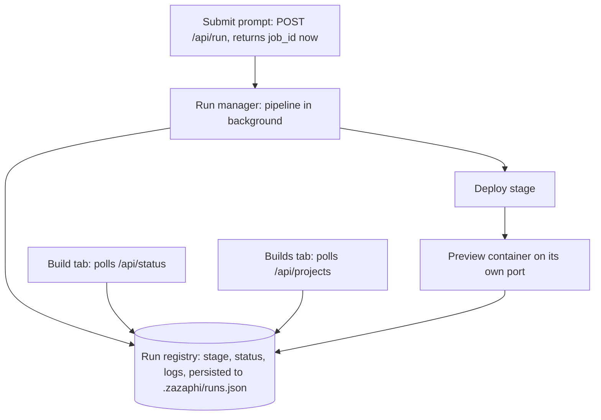
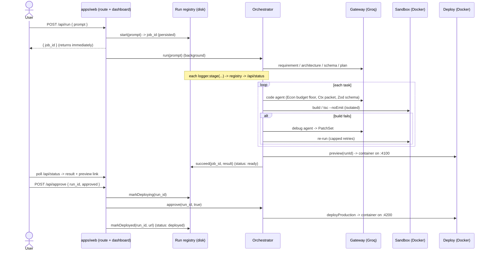
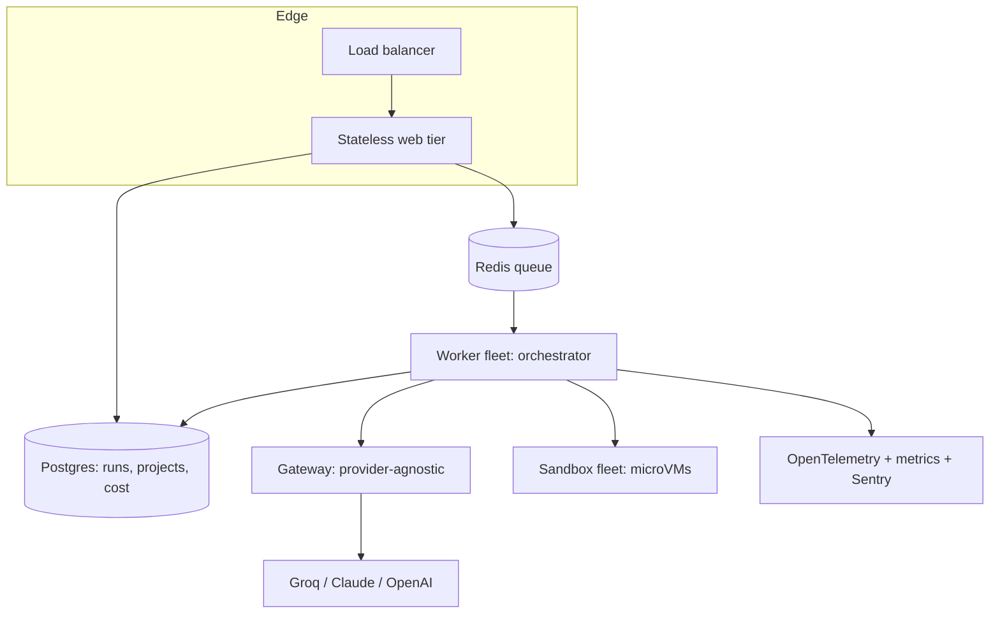

# ZaZaPHI — System Design & Production Engineering

> **What it is:** an AI app-builder that turns a one-line prompt into a running, deployed Next.js application.
> **The thesis:** the model writes the code, but *the orchestration layer is the product.*
> **Status:** MVP, working end to end on Groq — prompt → spec → architecture → schema → tasks → code → isolated build → preview → approval-gated production deploy → live link, with a persistent build dashboard.

This document is written to be read top to bottom. It explains the thesis, the architecture, every subsystem, the contracts that hold it together, the two cross-cutting concerns the project is really about — **context/caching** and **token/cost management** — what is genuinely production-real versus an MVP stub, and a senior-engineer's roadmap for taking each seam to production.

---

## Table of contents

1. [The one idea everything hangs on](#1-the-one-idea-everything-hangs-on)
2. [High-level architecture](#2-high-level-architecture)
3. [The pipeline (control flow)](#3-the-pipeline-control-flow)
4. [Shared contracts — the load-bearing layer](#4-shared-contracts--the-load-bearing-layer)
5. [The orchestrator and the ports](#5-the-orchestrator-and-the-ports)
6. [Subsystem: the LLM Gateway](#6-subsystem-the-llm-gateway)
7. [Subsystem: Context, memory & caching](#7-subsystem-context-memory--caching)
8. [Subsystem: Token & cost economics](#8-subsystem-token--cost-economics)
9. [Subsystem: Sandbox execution & the build loop](#9-subsystem-sandbox-execution--the-build-loop)
10. [Subsystem: Deploy, preview & the deterministic codegen-repair layer](#10-subsystem-deploy-preview--the-deterministic-codegen-repair-layer)
11. [Subsystem: Multi-service architecture (designed-in)](#11-subsystem-multi-service-architecture-designed-in)
12. [The async runtime: runs, the build dashboard & persistence](#12-the-async-runtime-runs-the-build-dashboard--persistence)
13. [End-to-end: a prompt's journey](#13-end-to-end-a-prompts-journey)
14. [Caching — deep dive](#14-caching--deep-dive)
15. [Token & cost management — deep dive](#15-token--cost-management--deep-dive)
16. [What is real vs MVP-stub](#16-what-is-real-vs-mvp-stub)
17. [How this maps to real systems](#17-how-this-maps-to-real-systems)
18. [Production-grade roadmap (the senior-engineer view)](#18-production-grade-roadmap-the-senior-engineer-view)
19. [Decision log](#19-decision-log)
20. [Glossary](#20-glossary)

---

## 1. The one idea everything hangs on

Anyone can wire up `prompt → LLM → code → done`. That is a demo, not a product, because the model is unreliable, stateless, and has no idea what a "running app" is. It will happily emit Python where you wanted TypeScript, read `localStorage` on a server, forget to `export` a component, invent file paths, import a package that was never installed, or get cut off mid-file when its output budget is too small.

ZaZaPHI treats the model as **one swappable, untrusted component behind a gateway**. Everything that actually makes generated software *ship* lives in the orchestration layer around it:

- deciding which agent runs and in what order,
- what files the model is allowed to see,
- how many tokens and retries each step gets, and which model tier handles it,
- forcing the model's output into a validated, typed shape,
- running the code in an isolated sandbox,
- repairing the model's predictable mistakes deterministically,
- gating production behind human approval,
- and tracking every run so the work survives a refresh or a restart.

The single sentence to defend:

> *I use Groq as the generation engine, but the product is the orchestration layer around the model — model routing, context assembly, structured-output enforcement with bounded repair, per-task token and retry budgets, isolated Docker execution, deterministic codegen repair, an approval-gated deploy, and a persistent run registry. The model never directly controls state, the filesystem, or deployment.*

The rest of this document is the evidence for that sentence.

---

## 2. High-level architecture

ZaZaPHI is a **pnpm monorepo** (TypeScript strict, Node 20, ESM). Each cross-cutting concern is a package with one responsibility and one owned contract; the apps are thin shells that wire packages together.



**Why this shape.** The orchestrator (`core`) depends only on **interfaces** (called *ports*), never on concrete subsystems. Each subsystem implements a port and is injected at wiring time (`apps/api/src/wiring.ts`, `apps/web/lib/engine.ts`). That seam is what lets the Groq gateway be swapped for Claude, the Docker sandbox swapped for a microVM provider, or the stub context swapped for real retrieval — without the orchestrator changing a line.

**Module-resolution detail.** Packages compile to `dist/` with `NodeNext` and explicit `.js` import extensions; `apps/web` uses bundler resolution with `transpilePackages` but still resolves to each package's built `dist/`. Practical consequence: editing a package's source requires rebuilding that package before the app sees the change, and the web dev server caches the orchestrator and the run registry on `globalThis`, so config-level changes need a full restart.

---

## 3. The pipeline (control flow)

A build is a fixed sequence of stages. The orchestrator drives it; the agents only ever return a structured result for one step.



The key invariant: **agents do not control the system, the orchestrator does.** The orchestrator decides which agent runs, the files it can see, the commands it may run, its token and retry budget, and whether human approval is required. An agent receives a `ContextPacket` and returns a typed object. Nothing more.

The error→fix loop is the heart of the build phase: a failed build produces a `SandboxResult` whose `error` and logs are fed back to the debug agent with the relevant file and recent patch, which returns a `PatchSet`, which is re-run — under a capped retry budget so a broken task cannot loop forever.

For the current scope (small, single-file-app-class projects), the planner emits **exactly one task** that generates the whole app in one shot, so cross-file imports line up by construction. Past the single-response output ceiling, the same loop runs many tasks in dependency order — that boundary is discussed in §15.

---

## 4. Shared contracts — the load-bearing layer

Every subsystem talks through a small set of typed shapes defined once in `@zazaphi/contracts` (Zod schemas + inferred TS types, validated at every boundary). No subsystem invents its own version. This is what lets each module be developed and reasoned about independently without drift.

| Contract | Shape (essentials) | Owner | Flows between |
|---|---|---|---|
| `TaskSpec` | `task_id`, `type`, `title`, `depends_on`, `target_files`, `constraints`, `budget_ref`, `status` | core | planner → orchestrator → agents |
| `ContextPacket` | `static_prefix_id`, `project_summary`, `current_task`, `schema_summary`, `relevant_files[]`, `recent_errors[]` | context | context → gateway |
| `LLMRequest` / `LLMResponse` | request: tier, prefix id, packet, token caps, schema; response: `output`, `usage{input,output,cached}`, `finish_reason`, `provider`, `model` | gateway | core → gateway → core |
| `TaskBudget` | `tier`, `model_tier`, `max_input_tokens`, `max_output_tokens`, `retry_limit`, `edit_mode` | economics | economics → core/gateway |
| `SandboxResult` | `task_id`, `status`, `command`, `exit_code`, `error`, `logs`, `files_changed`, `preview_url`, `duration_ms` | sandbox | sandbox → core |
| `ServiceManifest` | `mode` (single/multi), `services[]` (name, type, framework, port, command/image) | services | architecture → deploy |
| `GeneratedFile` / `PatchSet` | file `{path, content, mode}`; patch `{files, rationale}` | contracts | agents → sandbox/deploy |
| `RunResult` | `run_id`, `spec`, `architecture`, `manifest`, `tasks[]`, `preview`, `production?`, `awaiting_approval`, `cost` | core | pipeline → orchestrator → UI |

The deeper point: these contracts are the **stable interface of an unstable component**. The model's output is forced into `GeneratedFile[]` or a typed object; if it doesn't conform, the gateway repairs it before anything downstream ever sees malformed data.

---

## 5. The orchestrator and the ports

The orchestrator (`@zazaphi/core`) owns the pipeline, the per-task state machine, and the retry/approval logic. It depends only on these interfaces (`ports.ts`), each implemented by a subsystem:

```ts
LLMGatewayPort   // generateStructured(req, schema), stream(req)
ContextPort      // build(task, project, { includeErrors? }) -> ContextPacket
EconomicsPort    // budgetFor(task) -> TaskBudget, record(usage, model), ledger()
SandboxPort      // run({ task, command, files }) -> SandboxResult
DeployPort       // preview(runId), deployProduction(runId, approved)
ProjectStorePort // load/record project memory (spec, architecture, schema, manifest, fileMap, recentErrors)
Logger           // info / warn / error / stage — the progress hook the run registry consumes
```

The `Orchestrator` class is the only thing that starts a run or approves a deploy. `run(prompt)` mints a `run_id` and a `project_id`, executes `runPipeline`, stores the result keyed by `run_id`, and returns it awaiting approval. `approve(run_id, approved)` looks the run up and performs the gated production deploy. Because the orchestrator only knows the port shapes, "swap Groq for Claude" or "swap Docker for a microVM" is a wiring change, not a rewrite.

### The agents

Agents are thin functions over the gateway. Each takes a task + project memory, asks the context builder for a packet, asks economics for a budget, calls the gateway with a Zod schema for its output, and records usage:

- **Requirement** → `ProjectSpec` (product summary, stack)
- **Architecture** → `ArchitecturePlan` (summary, routes, components, `ServiceManifest`)
- **Schema** → `DatabaseSchema` (summary, tables)
- **Planner** → `TaskSpec[]`
- **Code** → `GeneratedFile[]`
- **Debug** → `PatchSet` (runs at a *high* budget, with errors included in context)
- **Test** → `GeneratedFile[]`

Design agents (requirement/architecture/schema/planner) use a small synthetic context; build agents (code/debug/test) use the real context builder so they see the project so far.

---

## 6. Subsystem: the LLM Gateway

`@zazaphi/gateway` is the only code that knows a provider exists. Everything above it speaks `LLMRequest`/`LLMResponse`.

**Provider.** Groq via `groq-sdk`. A factory returns the real `GroqGateway` when `GROQ_API_KEY` is set, otherwise a `StubGroqGateway` for offline development. The API key is read only inside this package.

**Model routing.** The request carries a `model_tier`; the gateway maps it to a concrete model (overridable by env):

| Tier | Model | Used for |
|---|---|---|
| small | `llama-3.1-8b-instant` | classification, docs |
| medium | `llama-3.3-70b-versatile` | CRUD / UI / app generation, planning |
| strong | `openai/gpt-oss-120b` | spec, schema, error fixing |

Routing matters because cost and latency scale hard with model size; trivial steps should never pay for a frontier model, and real code generation should never run on the weakest one.

**Structured output — the hard part.** Getting reliable JSON out of an LLM is the central reliability problem of the gateway. The approach:

1. A **stable system prefix** (identical across calls, so it is cacheable) states who the model is and the rules.
2. The serialized `ContextPacket` follows.
3. The **JSON Schema** for the expected output (derived from the Zod schema via `zod-to-json-schema`) is embedded with explicit "return JSON only, escape quotes and newlines" instructions; the request also sets Groq's `response_format: json_object`.
4. The response is parsed and **validated against the same Zod schema**.
5. On failure, the gateway issues **bounded repair round-trips** (up to `config.maxRepairs`, default 2). Each repair shows the model its previous attempt plus the exact validation error, and the repair prompt is **schema-aware** — it tells the model to fix wrong property names, wrong types, and out-of-range enum values, not just JSON syntax. If Groq itself rejects with `json_validate_failed`, the gateway extracts the `failed_generation` and routes it into the same repair path.
6. If repair still fails, it throws a typed `GatewayError` whose message **names the failing stage and the validation error** (e.g. `structured output for "Generate entire Next.js app" failed schema validation after 2 repair attempts: …`) rather than returning garbage — so failures are diagnosable, not opaque.

**Token-budget enforcement.** Before sending, the gateway estimates input tokens (system + serialized content) and refuses requests that exceed the task's `max_input_tokens`. This is a *cost guard*; the matching output guard lives in economics (§8), and the lesson that a too-small output cap truncates one-shot generation mid-string is in §15.

```mermaid
sequenceDiagram
    participant Core
    participant GW as Gateway
    participant Groq
    Core->>GW: generateStructured(LLMRequest, ZodSchema)
    GW->>GW: assemble [stable prefix + context + JSON schema]
    GW->>GW: estimate tokens, enforce max_input_tokens
    GW->>Groq: chat.completions.create(json_object)
    Groq-->>GW: candidate JSON
    GW->>GW: parse + Zod validate
    alt valid
        GW-->>Core: value + response(usage, model)
    else invalid (loop up to maxRepairs)
        GW->>Groq: repair round-trip (prior attempt + schema-aware error)
        Groq-->>GW: corrected JSON
        GW->>GW: validate; on final failure throw GatewayError naming the stage
    end
```

---

## 7. Subsystem: Context, memory & caching

`@zazaphi/context` decides **what the model is allowed to see** for each task. This is where coherence is won or lost.

**The memory model.** Per-project state is held by the store, and the model never sees all of it at once:

| Tier | Holds | Lifetime |
|---|---|---|
| Short-term | current task, current error, current files | one task |
| Project | spec, architecture, schema, route/component maps, file map | the project |
| Long-term | templates, known error fixes, reusable components | global |
| User | preferred stack, auth, deployment, UI style | the user |

**Context assembly.** For each task the builder produces a `ContextPacket`:

- a `project_summary` that **pins the chosen stack and architecture** into the text,
- the current task's title and constraints,
- a schema summary,
- and `relevant_files` — the files written so far, **target files first**, at full fidelity but **capped** (a small number of files, each clipped to a character limit) so the packet stays under the token budget,
- recent errors (only when debugging).



**Why this is the coherence fix.** Early on, each task was generated *blind*: the packet carried only the task's own (empty) target files, never the chosen stack or what prior tasks had written. The model re-rolled the architecture every step — Python in one file, vanilla JS in another, SQL in a third. Feeding the stack + architecture + prior files into every task is what turned the output from a polyglot pile into one coherent Next.js app. The hard rule remains: **never send the full repo** — send the summary plus only the relevant files at the lowest fidelity that works (`signature` < `summary` < `full`).

Caching design and the honest cache gap are covered in §14.

---

## 8. Subsystem: Token & cost economics

`@zazaphi/economics` turns "be careful with money" into enforced policy. It answers two questions per task: what budget, and what to do when a step fails.

A `TaskBudget` carries `model_tier`, `max_input_tokens`, `max_output_tokens`, `retry_limit`, and `edit_mode` (diff vs full-file). The per-tier table and the task→tier routing:

| Tier | Model | max in | max out | retries | edit mode |
|---|---|---|---|---|---|
| low | small | 2000 | 800 | 1 | diff |
| medium | medium | 6000 | 2500 | 2 | diff |
| high | strong | 12000 | 4000 | 3 | diff |
| very_high | strong | 24000 | 8000 | 2 | full_file |

| Task type | Default tier |
|---|---|
| `generate_schema`, `fix_error` | high |
| `generate_page`, `refactor`, `write_test` | medium |
| `docs` | low |

**The code-task output floor.** A whole-app build task emits every file in a single response, which is much larger than one-file-at-a-time generation. If such a task lands on a small tier, the model's JSON gets truncated mid-string and no repair can recover it. So `budgetFor` applies a **floor to every code-producing task** (everything except `docs`), regardless of the tier the planner assigned:



This guarantees a code task can never be truncated or run on the weakest model, no matter how the planner labels it — it is the deterministic fix for the one-shot truncation failure (§15).

**Two principles it enforces.** *Diff edits over full-file regeneration* — regenerating whole files is the biggest avoidable token cost and risks touching unrelated code, so edits are patches to specific files. *Capped retries* — a failing task retries a bounded number of times, then is marked failed, so a model that cannot fix its own bug cannot burn unlimited tokens looping.

Every gateway call's `usage` (input, output, cached) is recorded against its model in a `CostLedger`, which feeds the cost dashboard in the UI (calls, tokens in/out, cached).

---

## 9. Subsystem: Sandbox execution & the build loop

The sandbox is where untrusted generated code runs. The contract is `SandboxResult`: status, the command run, exit code, error, truncated logs, files changed, and timing.

The build verification is now real: a `DockerSandbox` implements `SandboxPort` and, on a build command, **materializes the project to disk and runs an isolated container that installs dependencies and type-checks (`tsc --noEmit`)**. A non-zero exit is parsed into the `error`/`logs` of a `SandboxResult`, which feeds the debug loop. A `PassthroughSandbox` (selected with `ZAZAPHI_SANDBOX=stub`) skips the container for fast iteration when you want the loop off; the `SandboxPort` is the seam that lets per-task runs become real containers — or microVMs — without touching the orchestrator.



The security model the real isolation enforces (and that a production sandbox must always enforce): **non-root execution, dropped Linux capabilities, no-new-privileges, memory/CPU/PID limits, a blocklist of dangerous commands, and no real secrets in the sandbox.**

> **Interaction with async runs.** A real build loop takes time, so it is only safe to leave on because runs are now asynchronous (§12) — the HTTP request returns immediately and the build (install + typecheck + retries) runs in the background while the dashboard streams progress. Synchronously, the long loop would time out the browser.

---

## 10. Subsystem: Deploy, preview & the deterministic codegen-repair layer

`@zazaphi/deploy` (`DockerDeploy`) turns a generated file map into a running container, and it is where the most interesting engineering lives, because it makes *imperfect model output shippable*.

**Two stages, two ports.**

- `preview(runId)` → a `zazaphi-preview` container on host port **4100**, running `next dev` (forgiving, fast to boot). Automatic.
- `deployProduction(runId, approved)` → a `zazaphi-prod` container on port **4200**, running `next build && next start` (strict, slow, real). **Requires explicit approval.**

One container per project; the previous one is removed each run. Containers run on `node:20-bookworm`, non-root (`--user uid:gid`), `--cap-drop ALL`, `--security-opt no-new-privileges`, with memory/CPU/PID limits. Deploy is non-blocking — it returns once the container starts, so the UI shows "deployed" before `next build` finishes (hence the ~60s wait before `:4200` serves).

### Materialization and the deterministic repair layer

Before a container builds, `materializeForPreview` writes the project to disk in three passes:

1. **Generated files**, each passed through deterministic repairs.
2. **Fallback entry files** only where the model left a gap (e.g. a placeholder `app/page.tsx` if none exists).
3. **Runtime files always forced** — a `package.json` that ships the TypeScript + Tailwind toolchain, a `next.config.mjs` that tolerates type/lint errors so imperfect code still builds, a `tsconfig.json`, Tailwind config + `postcss.config.js` + a forced `app/globals.css`, a forced `layout.tsx`, and a server-side `localStorage` stub.

The repairs are the concrete proof of the thesis. Across real runs the model produced several classes of deployment-breaking mistake, and **none of them killed the product**, because the orchestrator repairs each one deterministically before the container ever builds:

| Model mistake | What it caused | Deterministic repair |
|---|---|---|
| Wrote `use client;` (no quotes) | `next build` syntax error on line 1 | `normalizeClientDirective` rewrites a bare directive to `'use client';` |
| Read `localStorage` during render/SSR | prerender crash: `localStorage is not defined` | forced `layout.tsx` loads an in-memory server `localStorage` stub before any page renders |
| Defined the component but never `export default`-ed it | `Element type is invalid … got: undefined` | `ensureDefaultExport` appends `export default <Component>;` when none is present |
| Imported a package that was never installed (e.g. `date-fns`) | build fails on missing module | prompt forbids third-party packages; the forced toolchain installs only React + Tailwind |
| Arbitrary syntax error (brace mismatch, etc.) | `tsc` / `next build` failure | not regex-fixable → caught by the **real build loop** (§9) and patched by the debug agent |



Each repair is paired with a prompt rule that asks the model to do the right thing — belt and suspenders. The prompt reduces the failure rate; the deterministic repair guarantees the build survives when the model slips; and the build loop catches everything that isn't a known, regex-fixable class. That layering — **prompt rule, deterministic repair, real build loop** — is the design pattern of the whole system in miniature: *the model is unreliable; the orchestration layer makes its output safe to ship.*

---

## 11. Subsystem: Multi-service architecture (designed-in)

`@zazaphi/services` owns the `ServiceManifest`. The MVP always runs `mode: single` — one Next.js web service — but the architecture agent *emits the manifest either way*, and the manifest is what would generate a `docker-compose.yml` for a multi-service app (frontend + API + worker + Redis + Postgres).

**Why design it before needing it.** It costs almost nothing now to shape every layer around "there is a list of services," and it means moving to multi-service later is a config and compose-generation change rather than a restructuring of the orchestrator, the sandbox, or the deploy layer. Single vs multi becomes a property of the manifest, not a fork in the codebase.

---

## 12. The async runtime: runs, the build dashboard & persistence

The original pipeline was synchronous: `/api/run` ran the entire build before responding, so long builds dropped the browser connection (and the real build loop couldn't be left on). The runtime now decouples submission from execution and persists every run.



**How it works.**

- `POST /api/run` creates a record in the **run registry**, fires `orchestrator.run(prompt)` in the background, and returns a `job_id` immediately. The Orchestrator and pipeline are untouched — it is the same `run()` call, simply not awaited in the request handler.
- The registry captures progress from the existing `Logger` hook: a `RegistryLogger` routes every `logger.stage(...)` and info line the pipeline already emits into the active run's record. No new instrumentation in the pipeline.
- `GET /api/status?job_id=` returns the record; the **build tab** polls it and renders the real stage timeline plus a live log. (The pipeline emits stage events for requirement → architecture → schema → planner → preview; the build/sandbox loop runs between the planner and preview events, so the UI shows "Build" active during that gap, where the real time is spent.)
- `GET /api/projects` returns a summary of every run; the **Builds tab** is a live list — newest first — each row showing a status badge (**generating → preview ready → deploying → deployed**, or **failed**), the prompt, age, an Open link to its URL, and a **View** button that reopens the build in the main view.
- The approve route reports deploy status back to the registry (`deploying` → `deployed`, or `rejected`).

**Persistence.** The registry is **disk-backed**: a record is written to `.zazaphi/runs.json` the instant a prompt is submitted and rewritten on every stage, success, and deploy. So the Builds list and any in-flight or finished run **survive a browser refresh and a dev-server restart** — on startup the registry reloads from disk. The page also stashes the last `job_id` in `localStorage` and rehydrates it on load, resuming polling if the run is still going.

**Honest limits of the current implementation.** The run executes as an in-process background promise on a single long-lived Node server — fine for local development, but it dies if the process is killed mid-run, and a serverless host would terminate it after the response. One run is active at a time (the UI disables the trigger while building), which is why the registry logger targets a single active run. True concurrency (many projects building at once on their own ports) and durable mid-run recovery are the next steps — see §18.

---

## 13. End-to-end: a prompt's journey



---

## 14. Caching — deep dive

**The design.** Prompt caching on these providers keys off a **stable prefix**: if the leading bytes of the prompt are byte-identical to a previous call, the provider can reuse the computation for that prefix and bill those tokens at a steep discount (reported back as `cached_tokens`). ZaZaPHI is structured for this:

- the system prefix is a **constant** (`system_prefix_id = "zazaphi.system.v1"`) — the role, the rules, the styling contract — identical across every call,
- it is always placed **first**,
- the **dynamic** part (the serialized `ContextPacket`) is the **suffix**.

This is the correct shape: stable prefix first, variable content last, so the cacheable region is as long as possible.

**The honest gap.** In the current MVP, `cached_tokens` is still observed as **0**. The reason is that the context layer is a *capped heuristic* — it selects "the last N files, clipped" — rather than a true retrieval system that deliberately maximizes prefix stability across calls. The structure is right; the selection policy isn't yet optimized to keep the cacheable region identical from call to call.

**What kills a cache hit:** changing the prompt shape between calls, putting variable content before stable content, reordering the system rules, or letting the "stable" prefix drift. The fix is in §18 (embedding-based retrieval + a genuinely stable prefix), which is what turns the design into real `cached_tokens` savings.

---

## 15. Token & cost management — deep dive

Token spend is the dominant cost and latency driver, so it is managed at four levels:

1. **Model routing (tier).** Trivial steps (classification, docs) route to the small model; routine generation to the 70B; spec/schema/error-fixing to the strong model. Cost scales hard with model size, so this is the biggest single lever.
2. **Input budget + context discipline.** The gateway refuses any call whose estimated input exceeds `max_input_tokens`; the context builder never sends the full repo, sends target files first, and clips each file — so the input stays bounded and the build doesn't fail at the input guard.
3. **Output budget + the truncation lesson.** This is the subtle one. When generation moved to **one-shot whole-app output**, the output became several KB of escaped JSON. A task that landed on the `low` tier had only an 800-token output cap, so Groq truncated the response mid-string — the JSON ended with an unterminated string and *no amount of repair helped, because every retry truncated the same way*. The diagnostic error made it visible (it named the stage and the parse error); the fix was the **economics floor**: every code-producing task gets at least an 8000-token output budget and at least the 70B model. The general principle: **a one-shot generator has a hard output ceiling, and the budget must clear the size of what you ask it to emit in one response.**
4. **The one-shot ceiling as an architectural boundary.** That ceiling is exactly where the design switches strategies. For a small app (the chosen envelope), the whole thing fits in one response and the planner emits one task, so imports line up by construction. A genuinely large app — more code than a single response can hold — *must* fall back to the multi-task path: the planner emits many tasks, they run in dependency order, each sees the prior files plus the real build loop. The system routes by size at planning time. The truncation incident is what makes this boundary concrete rather than theoretical.

Two more standing rules: **diff edits over full-file regeneration** (the biggest avoidable cost, and it avoids touching unrelated code), and **capped retries** (a model that cannot fix its own bug cannot loop forever). Every call's usage is recorded to the cost ledger and surfaced in the dashboard.

---

## 16. What is real vs MVP-stub

| Subsystem | Real today | MVP-stub / known gap |
|---|---|---|
| LLM Gateway | Real Groq, routing, structured-output validation + **bounded multi-repair**, schema-aware repair prompt, diagnostic errors, `json_validate_failed` recovery, input guard | no streaming UI yet |
| Context | Real assembly: stack + architecture + prior files, capped to budget | heuristic selection, not embedding-based retrieval; `cached_tokens` still 0 |
| Economics | Real per-task budgets, **code-task output floor**, retry caps, usage recording, cost dashboard | static routing table, not adaptive |
| Sandbox | **Real Docker build loop** (`tsc --noEmit` in an isolated, non-root, capped container); passthrough mode for fast iteration | in-process verification when stubbed; not a persistent per-task container fleet |
| Deploy | **Real Docker**: isolated non-root container, preview + approval-gated prod, deterministic repairs | one host per stage, local ports; not multi-tenant infra |
| Multi-service | Manifest emitted and shaped through every layer | only `single` mode is executed |
| Async runtime | Real async runs, **disk-backed run registry**, live build dashboard + persistent Builds list, refresh/restart recovery | single in-process worker; one active run at a time; dies if the process is killed mid-run |
| Pipeline | Real end-to-end on Groq | full run is a single background job; no queue |

This honesty is itself a design value: the contracts and ports make every stub a clearly-marked seam with a real implementation behind a single interface, so "make it real" never means "rewrite it."

---

## 17. How this maps to real systems

The architecture is deliberately the same shape used by production app-builders and sandbox providers, which is what makes the seams credible:

- **Bolt / v0** get reliability by *pinning one known stack and structure* and feeding full project context on every generation — exactly the coherence fix in §7. ZaZaPHI pins a single client-side Next.js app for the same reason.
- **E2B / Modal** run untrusted code in Firecracker microVMs or gVisor with snapshots and persistent filesystems. ZaZaPHI's `SandboxPort` and `DeployPort` are the interfaces you would implement an E2B or Modal adapter behind, with zero orchestrator changes.
- **StackBlitz / Bolt in-browser** use WebContainers (WASM) to avoid server compute entirely — a different point on the same design space, reachable by another adapter behind the same ports.

The portability is the point: the orchestrator commits to *what* happens (isolate, build, repair, gate), never to *how* a given provider does it.

---

## 18. Production-grade roadmap (the senior-engineer view)

The MVP proves the architecture. Taking it to production is mostly about replacing in-process, single-node, in-memory pieces with durable, isolated, observable, horizontally-scalable ones — *behind the ports that already exist*. Roughly in priority order:

### 18.1 Execution & durability
- **Job queue + worker pool.** Replace the in-process background promise with a real queue (Redis + BullMQ, or SQS). `/api/run` enqueues; a pool of stateless workers consumes. This survives process restarts, enables concurrency, and works on serverless/containerized hosts where post-response work is otherwise killed.
- **Durable run/project store.** Replace `.zazaphi/runs.json` with Postgres (runs, projects, tasks, cost ledger as tables). Gives concurrent-safe writes, real queries (filter by status/user/date), and durability. The JSON file is correct for local dev; a DB is the production form of the same registry.
- **Mid-run recovery & idempotency.** Persist run state at each stage transition; on worker crash, resume or fail-cleanly. Idempotency keys on `/api/run` so a retried submit doesn't double-build.
- **Graceful shutdown.** Drain in-flight runs and stop containers on SIGTERM; health/readiness probes for orchestration.

### 18.2 Sandbox & isolation
- **microVM / gVisor sandbox.** Implement the `SandboxPort` against E2B, Modal, or Firecracker directly — per-task, snapshot-restored, with a real isolated filesystem. Stronger isolation than Docker-per-project and far better at scale.
- **Per-project port allocator + LRU eviction.** A managed port pool so multiple previews run at once; when the pool is full, stop the least-recently-used container and reclaim its port without deleting the project record. (This is the remaining half of the multi-project runtime.)
- **Sandbox hardening.** Network egress allow-listing inside the sandbox, seccomp profiles, image scanning, read-only root FS, ephemeral overlay for writes, and strict CPU/memory/PID/time quotas per run.

### 18.3 The model layer
- **Native structured output.** Move from prompt-and-validate to provider tool-calling / function-calling or **constrained decoding (grammars / JSON-schema-constrained generation)**, which makes invalid JSON impossible rather than repairable. Keep the Zod validation as a backstop.
- **Streaming.** Stream tokens from the gateway into the build view so long generations show progress live (the `stream()` port method already exists).
- **Adaptive routing + eval harness.** A codegen eval suite (build-success rate, repair rate, runtime correctness) that drives routing — send logic-heavy or previously-failed apps to a stronger tier automatically. Maintain a few-shot / template library of known-good patterns and known-error fixes (the long-term memory tier).
- **Multi-step generation for large apps.** Formalize the planner's task DAG for apps beyond the one-shot ceiling, with `target_files` constrained to `app/**` so stray files can't appear, and topological execution with the real build loop per task.

### 18.4 Context & caching
- **Embedding-based retrieval.** Replace the capped heuristic with semantic file selection (embed files + signatures, retrieve by relevance to the task), plus a project index (tree + exports) and a fidelity ladder (full for touched files, signature for imported, path-only for the rest).
- **Real prompt caching.** Stabilize the prefix deliberately so `cached_tokens > 0`, turning the existing cache-friendly structure into actual cost savings.

### 18.5 Observability & cost control
- **Structured logging + tracing.** OpenTelemetry spans per stage and per model call; correlate by `run_id`. Error tracking (Sentry).
- **Metrics & dashboards.** Per-stage latency, tokens and cost per run, repair rate, build-loop iterations, deploy success rate, container lifetimes.
- **Budgets & alerts.** Per-user/org token budgets with hard caps, spend alerting, and automatic model-tier downgrade under budget pressure. The cost ledger is already the hook for this.

### 18.6 Security, multi-tenancy & platform
- **Auth + RBAC + quotas.** Per-user/org isolation, resource quotas, and rate limiting on `/api/run`.
- **Secrets management.** Vault/KMS for production environment variables; never materialize real secrets into the sandbox (the current rule, enforced at the platform level).
- **Reliability patterns.** Exponential backoff + circuit breakers on the gateway, bulkheads between subsystems, and dead-letter queues on the job queue.
- **Horizontal scale.** Stateless web tier + shared run store (Postgres) + Redis queue + a worker fleet + a sandbox/deploy fleet, all on Kubernetes; the ports keep each tier swappable.



### 18.7 Engineering process
- **CI/CD + tests.** Formalize the typecheck-in-a-harness discipline into the repo: unit tests for the deterministic repairs and normalizers, integration tests for the pipeline against a stub gateway, and e2e tests that build a known app and assert the container serves. Typecheck and lint as merge gates.

The throughline: **every item above slots behind an interface that already exists.** That is the dividend of the ports/adapters design — production-hardening is replacement, not rewrite.

---

## 19. Decision log

| Decision | Choice | Why |
|---|---|---|
| Inference provider | Groq for MVP, behind a gateway | fast + cheap now; never lock the product to one provider |
| Provider abstraction | day-one port + structured output | swapping models is a wiring change |
| Stack | single client-side Next.js app, pinned in the system prefix | coherence; the runtime and the generated code finally agree |
| Context | stack + architecture + prior files, capped to budget | incremental generation, no full-repo resend, stays under token cap |
| Codegen reliability | prompt rule + deterministic repair + real build loop | the model is probabilistic; the build must be deterministic |
| Structured output | JSON-schema-in-prompt + Zod validation + bounded multi-repair | reliable typed output from an unreliable model, without infinite retries |
| Output budget | floor code tasks to >= 8000 tokens / >= 70B | one-shot whole-app output truncates on small caps |
| Sandbox | real Docker build loop; stub for fast iteration | spend isolation where untrusted code is actually run/served |
| Deploy | Docker per project, non-root, capped; preview auto, prod approval-gated | full control, good enough for MVP; safety + cost on prod |
| Service mode | single MVP, manifest designed in | ship fast without painting into a corner |
| Runtime | async runs + disk-backed run registry | long builds can't time out the request; work survives refresh/restart |
| Editing | diff/patch over full-file regen | biggest token saving, avoids touching unrelated files |

---

## 20. Glossary

- **Orchestrator** — the controller that owns state, budgets, files, sandbox, approval, and the run lifecycle. The product.
- **Agent** — a single model-driven step (requirement, architecture, code, debug, test). Sees only its `ContextPacket`.
- **Context packet** — the minimal assembled input for one model call.
- **Static prefix** — the stable part of the prompt (system role, rules, schema) kept first for cache hits.
- **Fidelity ladder** — `signature` < `summary` < `full`: the lowest detail level of a file that still works.
- **Diff edit** — generating a patch to specific files instead of regenerating whole files.
- **Tier** — model strength class: small / medium / strong.
- **Budget floor** — the minimum model tier and output budget forced for any code-producing task.
- **Deterministic repair** — a fixed code transform applied to model output before build (e.g. `ensureDefaultExport`).
- **Build loop** — code → isolated build → debug patch → re-build, under a capped retry budget.
- **Sandbox** — isolated container where untrusted generated code runs.
- **Service manifest** — declarative list of services that drives docker-compose.
- **Run registry** — the disk-backed record of every run; powers the build dashboard and survives restarts.
- **job_id vs run_id** — `job_id` tracks a submission from the instant of submit (app-side); `run_id` is the orchestrator's run identifier, surfaced once the pipeline starts/returns.
- **Preview vs prod** — preview link is automatic; production deploy requires human approval.

Made with 💖 by Prateush Sharma
